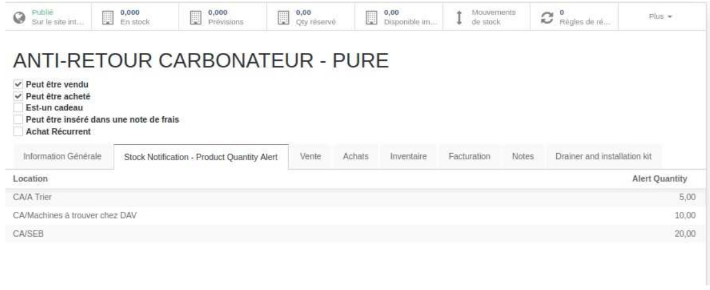

# Exercise 2: Develop a Module to Send Stock Status Report by Email

## Task
Develop a module that sends a report via email about the stock status of storable items where a minimum alert quantity (Qty min) has been defined:

### What to Do:

1. **Add a new page in the product form** 
   Add a page in the product form where you can input the alert quantities by location for each storable product.
   

2. **Develop a cron job to send a report by email**  
   Create a cron job that sends a daily email with a PDF report listing all items where the available quantity minus the alert quantity is less than 0.
   
### Email Structure and Report to Send Every Day:

**Email Body:**
  
  Dear [Recipient],

Your Stock Reorder Report is attached.

**Report Table Content (attached as PDF):**

| Article | Location | Available Qty | Alert Qty | Available Qty - Alert Qty |
|---------|----------|---------------|-----------|---------------------------|
| Product A | Location 1 | 70 | 50 | -20 |
| Product A | Location 2 | 20 | 21 | -1 |
| Product B | Location 1 | 50 | 10 | -40 |

- **Article:** Name of the product.
- **Location:** Warehouse location where the product is stored.
- **Available Qty:** The available quantity of the product.
- **Alert Qty:** The alert quantity of the product.
- **Available Qty - Alert Qty:** Difference between the available quantity and the alert quantity.

### Requirements:
- Implement a user interface for setting the alert quantities by location.
- Create a cron job that runs daily to check if any storable items have a quantity below the alert level and generate the report.
- Send the report via email in PDF format, as shown in the example.

### Deliverables:
- A working Odoo module that integrates the alert quantity feature in the product form.
- A cron job that generates and sends the report every day.
- A PDF attachment containing the stock reorder report.

---

**Good luck and happy coding!**

