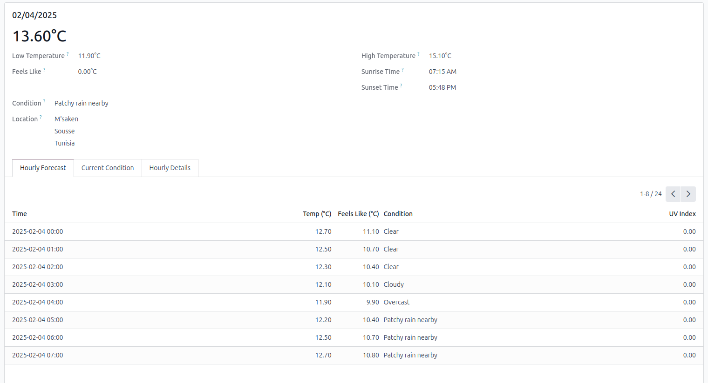
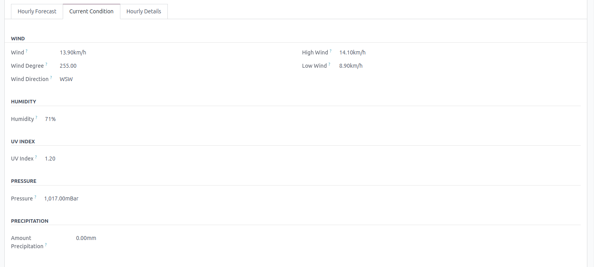
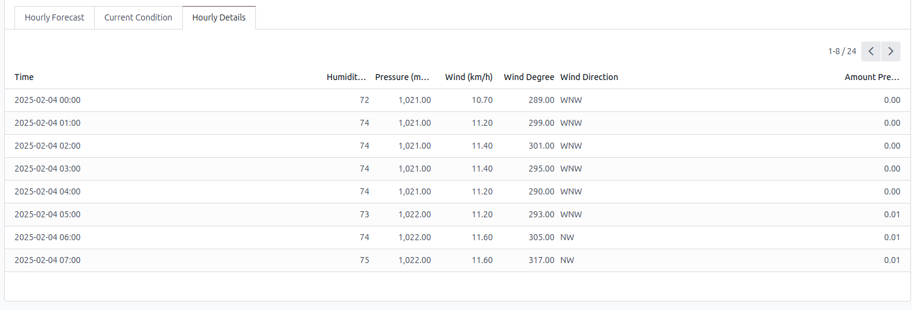
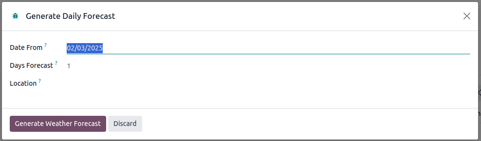
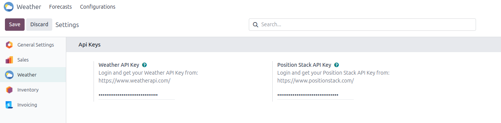
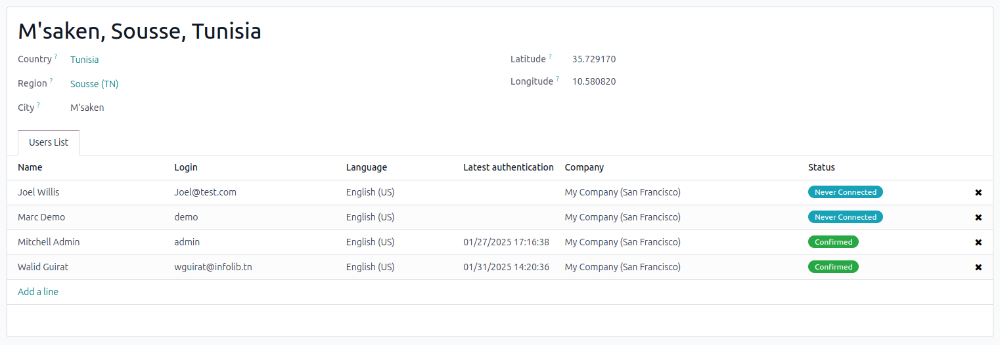
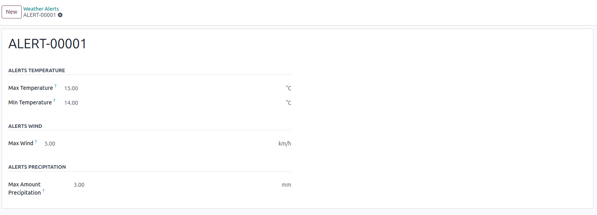
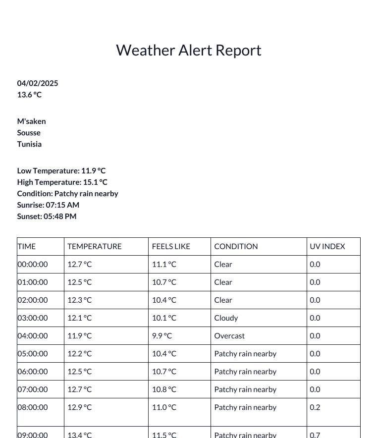

# Exercise 3: Develop a Weather Forecast Application

## Task
Develop a new Odoo module to retrieve daily weather forecasts for a specific region within a defined period:

### What to Do:

***Part 1:***

We will use a web service or a library to retrieve real-time weather forecasts.
In our case, we have chosen to use the web services from [https://www.weatherapi.com/](https://www.weatherapi.com/).
You can either use the API directly or a Python library.

1. **Create an entity to retrieve all the necessary weather forecast information:**
   
   Required fields:
   
    - Date
    - Location
    - Temperature (current, max, min)
    - Wind (current, max, min)
    - Condition (for example: Clear)
    - UV
    - Sunset & sunrise
    - Add a page (list) for hourly forecasts.
   

2. **Add a wizard to generate forecasts by:**

    - Date
    - Forecast Days
    - Location
   
    Use the web service or the **"Weather API"** library to generate the necessary data.
    

3. **Add a configuration menu consisting of:**

* A view to retrieve the *****"API KEY"***** for the web services.

* A view to add the list of locations, with the following fields for each location:
    - Name
    - Region
    - Country
    - Latitude
    - Longitude

> **Note:** You can use a web service or a library to add the coordinates (latitude, longitude) for a location. It is suggested to use [https://positionstack.com/](https://positionstack.com/).
    

***Part 2:***

In this section, we need to add alerts to notify users of our system. The alerts are predefined in a view under the Configuration menu.

1. **Add a view for alerts consisting of 4 fields:**

    - Maximum Temperature
    - Minimum Temperature
    - Maximum Wind
    - Maximum Precipitation Amount
    
> **Note:** Add a list of users for each location to send them alert emails (see the following figure).

2. **Develop a cron job that sends a report (PDF) via email with the forecast for the next day if:**
   
    - The temperature > the maximum alert temperature
    - The temperature < the minimum alert temperature
    - The wind speed > the maximum alert wind speed
    - The precipitation amount > the maximum alert precipitation amount
   

**Structure of the email to be sent:**

Dear,
Tomorow, the temperature may exceed **“Temperature maximum”**, the wind speed may
be more than **“Wind maximum”** and the total amount of precipitation is **“Max amount
precip”**.

**Structure of the report to be sent:**

---

**Good luck and happy coding!**

